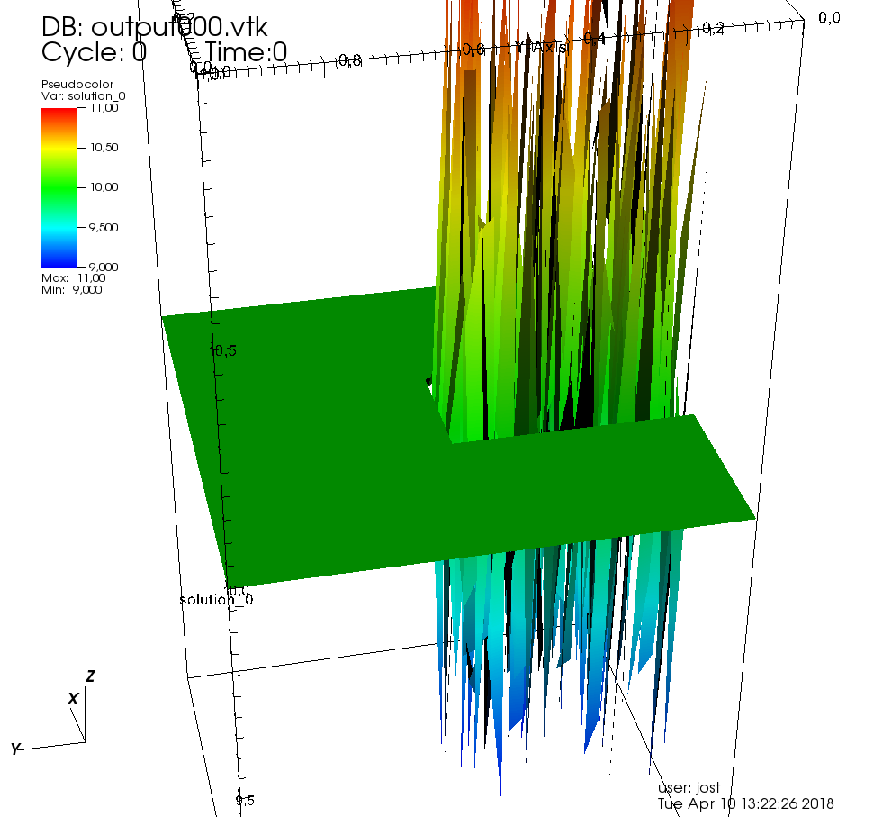
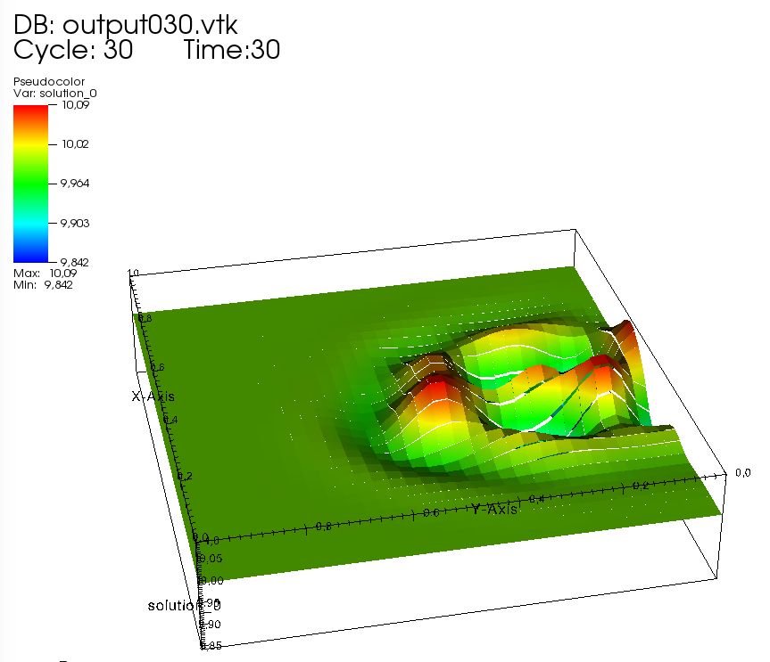
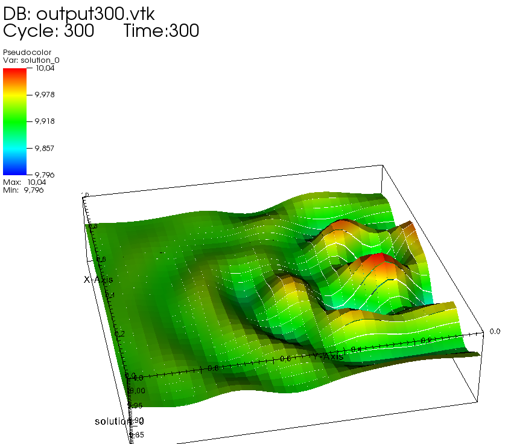

# Bachelor_source_code
This is the source code of a reaction-diffusion differential equation, coded in c++ using amandus  ( https://bitbucket.org/guidokanschat/amandus/src/master/ ) and deal.II ( https://www.dealii.org/ )

The used reaction diffusion-equation is the following:

$u_t = \Delta u + f(u,v)
 v_t = d \Delta v + g(u,v)$

with
$f = a - u - h(u,v)
g =\alpha (b -v ) - h(u,v)
h(u,v) = \dfrac{\rho u v}{1 + u + K u^2}$

The important code is hidden in the *.cc files, the physics of the system is defined in the explicit.h, implicit.h, matrix.h.
The outpuut of the compiled program depends dynamically on the parameter files and outputs *.vtk files for a 3D Visualization.

Here are some examples of one reactant starting randomly distributed in some area resulting in a steady-state pattern. The visualitation is done with the use of VisIT.
Initial state:

After 30 timesteps:

After 300 timesteps:

